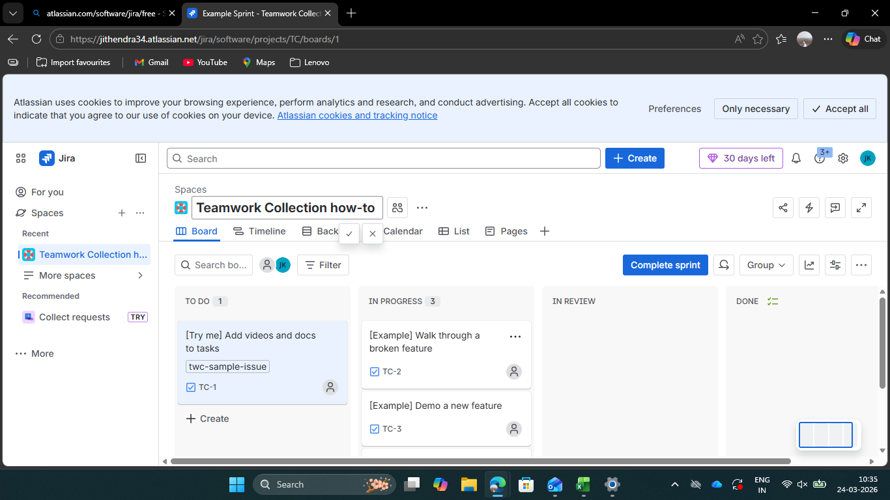
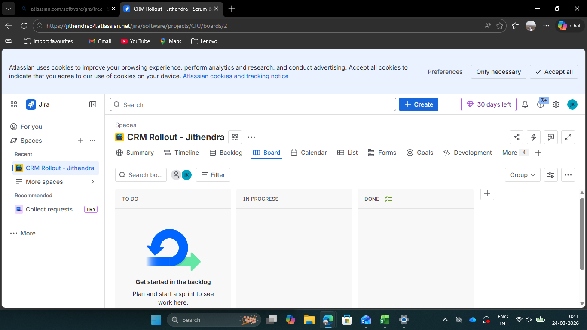
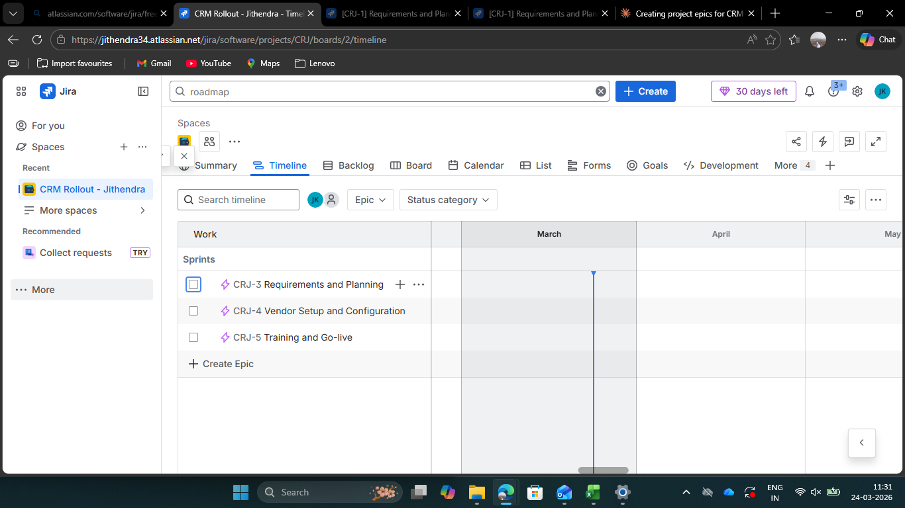
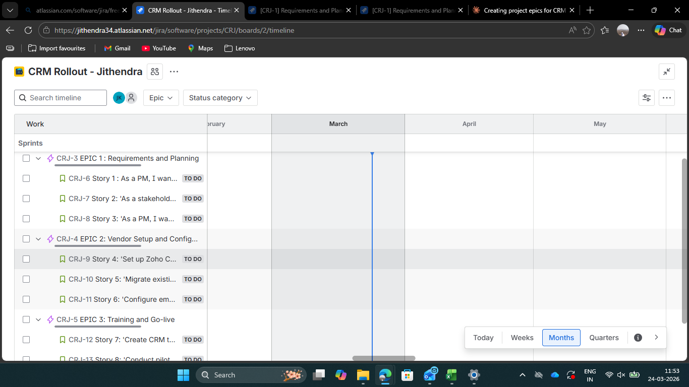
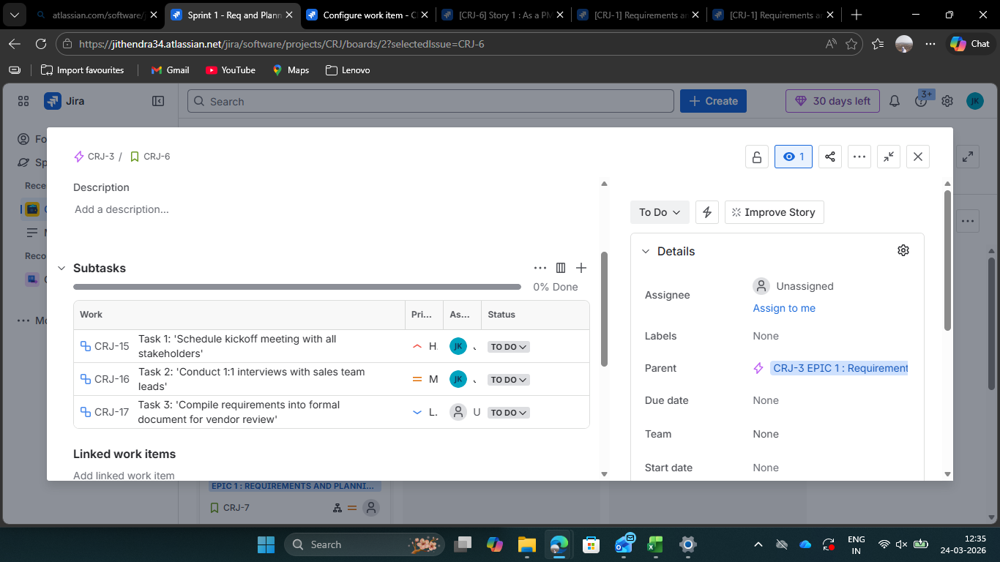
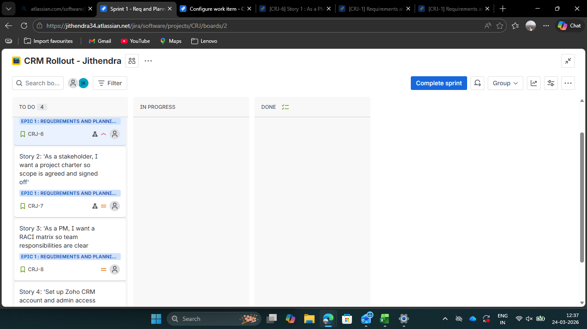

 Jira Project Management Demo

This repository showcases my hands-on Jira project management demo created to demonstrate practical understanding of project coordination, Agile workflow, sprint planning, backlog management, and task tracking.

Project Title
    CRM Rollout – Jira Demo Project

 About This Demo
This is a self-created Jira practice project built to simulate how a Project Coordinator / PMO / Junior Project Manager can plan, organize, and track a CRM rollout using Agile workflow in Jira.

 What This Demo Includes
- Jira project setup
- Board configuration
- Epics creation
- User stories creation
- Subtask breakdown
- Sprint board workflow
- Sprint progress tracking
- Burndown chart tracking
- Backlog management

 Skills Demonstrated
- Project Coordination
- Agile / Scrum Basics
- Jira Workflow Management
- Task Tracking
- Sprint Planning
- Requirement Structuring
- Work Breakdown Structure (WBS)
- Backlog Monitoring
- Progress Tracking

 Tools Used
- Jira
- GitHub

 Screenshots
## Screenshots

### 1. Jira Setup

### 2. Project Board

### 3. Epics Timeline

### 4. User Stories

### 5. Subtasks Breakdown

### 6. Sprint Board

### 7. Sprint Progress

### 8. Burndown Chart

### 9. Backlog View

Why I Built This
I created this Jira demo project to strengthen my practical understanding of project coordination, sprint workflows, backlog handling, and Agile project tracking while preparing for entry-level Project Coordinator, PMO Analyst, and Operations roles.

 Author
   B. Jithendra Kumar
- Portfolio: https://bjkportfolio.netlify.app/
- LinkedIn: https://www.linkedin.com/in/bjithendrakumar
- GitHub: https://github.com/jithu-07
